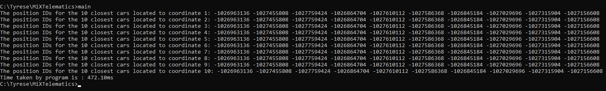

# Tyrese attempts Vehicle Position Challenge 

## Thought process
  * Firstly tried to read through binary data and put relevant data(positionID, coordinates) of each car into an array. Unsure as to whether this was done correctly as some positionIDs are negative?
  * Once the data has been fully read...apply the 'square' algorithm to immensely reduce the amount of cars that distances need to be calculated for.
  * Following this, the distance of each car to each coordinate is calculated and organised in ascending order.
  * The results are stored and then consequently printed out after all the coordinates have been addressed.

## "Square" algorithm
  * Firstly...I was unsure as to what to call the algorithm I used, and square seemed most appropriate.
  * The way it works is by placing a 'square' of fixed area around the specific coordinate.
  * If a car falls within this square, it is stored. If it falls outside this square, the car is discarded.
  * The area of the square is controlled using an "x_threshold" and "y_threshold". These parameters can be adjusted depending on the amount of cars needed and the data being analysed.
  * The square is recalculated for each coordinate.

## Execution time
 * My solution on average takes about 470ms on my desktop. A screenshot of this can be seen below.
 